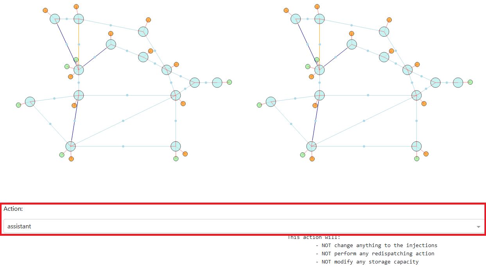
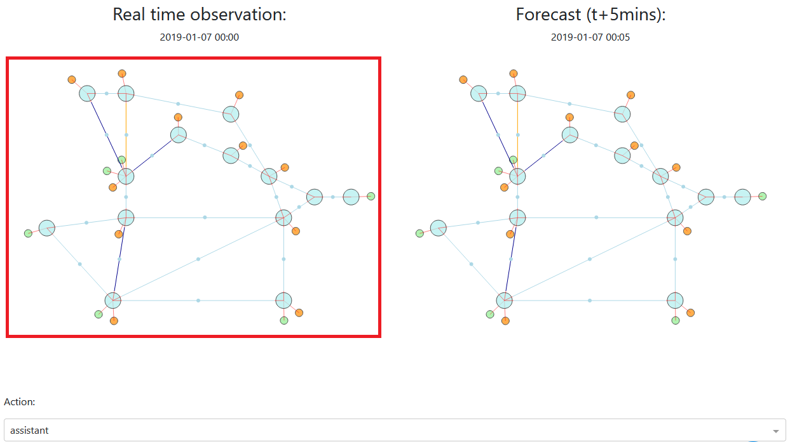

.. Copyright (c) 2019-2020, RTE (https://www.rte-france.com)
   See AUTHORS.txt
   This Source Code Form is subject to the terms of the Mozilla Public License, version 2.0.
   If a copy of the Mozilla Public License, version 2.0 was not distributed with this file,
   you can obtain one at http://mozilla.org/MPL/2.0/.
   SPDX-License-Identifier: MPL-2.0
   This file is part of Grid2Game, Grid2Game a gamified platform to interact with grid2op environments.

.. |control_panel_chronic| image:: ./img/ControlPanel_chronic.png
.. |control_panel_seed| image:: ./img/ControlPanel_seed.png

.. |grid_timeline_scen_info| image:: ./img/grid_timeline_scen_info.png
.. |control_panel_control_buttons| image:: ./img/ControlPanel_scenario_control.png

.. |action_storage_2| image:: ./img/action_storage_2.png

.. |action_sub_2| image:: ./img/action_sub_2.png
.. |action_sub_3| image:: ./img/action_sub_3.png

.. _page_play_the_game:

First usage example: play the "grid2op game"
=============================================

Once you started a grid2game server with a given grid2op environment, you can easily
start operating the grid on a given scenario (a scenario is analogous to a "level" in a video
game).

Choose a scenario
---------------------
To choose a scenarion, you simply need to click on the dropdown list:

|control_panel_chronic|

As some environments are stochastic, you might also want to chose a seed for this scenario (
if you use the same seed on the same scenario, all the "stochastic" components will be
the same. For example, maintenance operations will happen exactly at the same time, concern 
the same powerline, the opponent will attack at the same time for the
same duration etc.)

This can also be achieved in the GUI by entering a number in the appropriate field:

|control_panel_seed|

Once done, you will need to "reset" the environment by pressing the "reset" button:

|control_panel_reset|

And you can start operating the grid !

To make sure the scenario is properly configured, you can have a look at the information just above the
grah of the powergrid:

|grid_timeline_scen_info|

(in this example, the scenario named "0002" has been selected and no seed has been set)

Play interactively
---------------------

Once the scenario is loaded, you can interact with the grid just like any "agent". Here are the 
main commands similar to "env.step(action)"

.. note::

    We will explain in the next section (:ref:`sec_play_the_game_action`) how to chose the action

All the interesting buttons are located there:

|control_panel_control_buttons|

In this "quickstart" we only detail a few of them. More information can be found in the dedicated
page: :ref:`page_step_back_end` .

Step
~~~~~~~~

This button allows you to perform a single "step" on the environment. It is rather straightforward.

Simulate
~~~~~~~~~~

Compatible with the grid2op framework, we added the possibility to use a model of the grid (a simulator) to assess if a
given action is good or not. This is done with `obs.simulate(action)` (more info on the official grid2op documentation).

This "simulate" button allows you to do that. The resulting grid state (of the simulation) is displayed on the right.

+12
~~~~~

A scenario can last more than 1000 steps (usually even more than 8000). In this case it would be very impractical to clik on the
"step" button more than 1000 times in order to get to the end of the scenario.

For this purpose, the "+12" button allows you to perform more than one step when you click on it.

.. note::

    You can customize how many steps you want to perform per click by entering a digit in the "steps" field.

It has the following behaviour:

- when the assistant raises an alarm, the computation is stopped, and you see the grid state just after the assistant 
  raised the alarm.
- when there is a game over, the computation is also stopped.
- the action performed is determined by the value of the dropdown "action" panel (see image bellow). By default the action
  is the one suggested by the "assistant" (eg the agent helping the human), but you can replace it with:
    
    - "do nothing": the do nothing action will be performed
    - "assistant" (default): let the assistant (if any has been entered) chose. (if no assistant is present, it is replaced
      with "do nothing")
    - "previous": always do the same action. 

|which_action|

Once you click on it, you the application will be in a "computing" state, you can see it with the appropriate flag:

|app_computing|

When this is happening, we do not recommend you to interact with the application anymore: do not press any button.

.. warning::

    **TL;DR**: Do not attempt to press any "grey" button.

End
~~~~

It behaves the same way as "+12" (see section above). The only difference is that it does not compute a certain number of
steps but rather tries to go until the "end". In other words, it will stop the computation when:

- the assistant raises an alarm
- there is a game over (total blackout)
- the scenario is over (you successfully managed the entire scenario)

.. _sec_play_the_game_action:

Choose an action
-----------------

There are multiple ways to chose an action, that you can control from the "Action" part of the UI:

|which_action|

You can chose an action using different methods.

Automatic actions
~~~~~~~~~~~~~~~~~~~~~~~~

When you select some action types in the approppriate dropdown:

- "do nothing": in this case you ask the app to not take any action (you do nothing)
- "previous": always do the same type of action, chose an action once, and it will be done again and again 
- "assistant" (*default*): let the "assistant" (an AI) chose an action (by defaut not agent are given, in this case it will
  do nothing) 

Manual action
~~~~~~~~~~~~~~~~~~~~~~~~

The UI lets you define some manual actions that you want to perfom on the grid.

To select which action you want to do, you can click on the "real time" graph of the grid:

|real_time_obs|

Most of the time these actions ar straightforward. If you want to modify the setpoint of a storage unit, click on it,
and modify it with a slider. If you want to disconnect a powerline, click on it and select "disconnect" etc.

.. note::

    We remind that more information for the action are availble on the dedicated page: :ref:`page_available_action`

Line status
++++++++++++

To do such action, you first need to clic on a powerline. For example, for the environment displayed, you can click in each
on the arrow:

|action_line|

And then (in this example we clicked on the higher powerline) this appear:

|action_line_1|

And you can confirm which action you took:

|action_line_2|

Redispatching
++++++++++++++

These actions can be made by clicking on a dispatchable generator (for example of type "nuclear", "hydro" or "thermal").

They consist in increasing / decreasing the amount of power the produce.

In our example, there are given there:

|action_redisp|

And you can chose the amount of redispatching you perform by moving the slider. As for the other type of action,
you have a text representation of this action.

|action_redisp_2|

Curtailment
++++++++++++

These actions can be made by clicking on generator coming from renewable energy sources (for example "solar" and "wind").

They consist in limiting the amount of power that can be produced by this generator.

In the example grid, you can click on these one:

|action_curtail|

You can chose the limit you want to impose by moving the slider (to the right if you want to "limit more" - *eg* when a
problem arises* - or to the left if you want to "limit less" - *eg* when a problem is over and you want to 
allow as much renewable energy on the grid).

|action_curtail_2|

Topology
++++++++++++

For making topological actions, you have to click on substations, represented by large disks on the interface:

|action_sub|

In this graphical user interface, each object at the substation you clicked on are visible in a "zoomed in" plots, 
as shown here:

|action_sub_1|

On this plot, each "radial line" represents an object connected to this substation as shown here:

|action_sub_3|

On each substation, in grid2op, you have the choice to assign elements on one of the two "buses".  Each being
represented by a circle inside the substation, as shown here:

|action_sub_2|

In the GUI it can be achieved by clicking on the intersection of each elements (shown as straight lines) and the bus
to which you want to connect it (represented by circles). And as always, the resulting action is shown (as
text) on the right.

In this example, we clicked on the 3 circles showed bellow:

|action_sub_4|

Storage units
++++++++++++++++++++++++

These actions can be achieved by clicking on storage units, as shown here.

|action_storage|

And as for many possible actions in the GUI, you can modify it by acting on the slider:

- to the left: you ask the storage unit to produce something. It will empty the storage unit and provide some 
  power to the grid (behaving similarly as a generator). It is only possible if the storage unit is not empty.
- to the right: you ask the storage unit to absorb power. It will charge the storage unit and take some
  power from the grid (behaving like a load). It is only possible if the storage unit is not full.

|action_storage_2|
