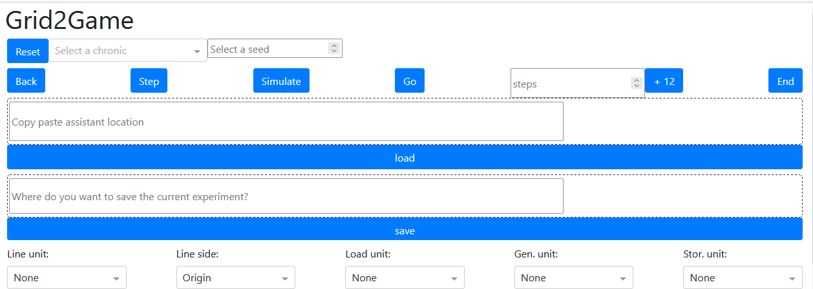
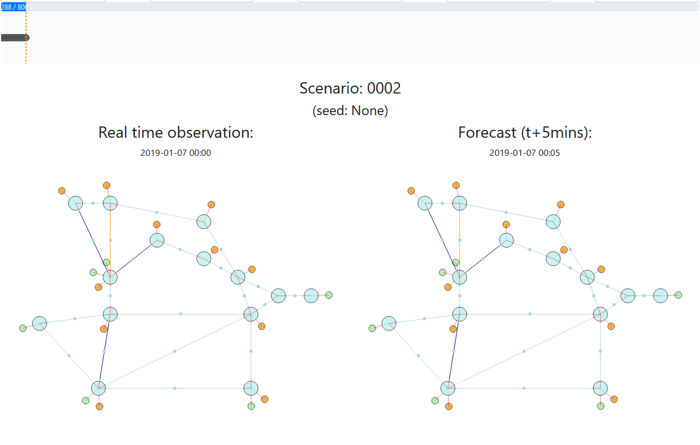
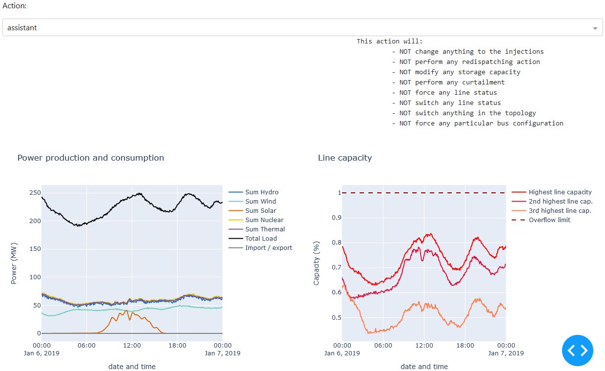

Getting started
===================================

Install grid2game
------------------------------------

As of writing, the only possible way to install grid2game is to install it with pip from the github repository.

It can be achieved with:

.. code-block:: none

    pip install git+https://github.com/bdonnot/grid2game.git

.. warning::
    We more than recommend to use a dedicated virtual environment when installing grid2game. Indeed it depends on
    different packages and we found that it works much better inside a python virtual environment.

    On linux / macOS you might create one with: `python3 -m virtualenv venv` [need to be done once]
    and then, each time you want to use grid2game, you can activate it with:  `source venv/bin/activate`

    On windows 10 (and I suppose windows 11 too, but with Microsoft who knows...), 
    you can create one with: `py -m virtualenv venv` [need to be done once]
    and then, each time you want to use grid2game, you can activate it with:  `.\venv\Scripts\activate.ps1`

.. note::
    We highly recommend you to use lightsim2grid backend if you want to use grid2game. Otherwise the application
    will be way less responsive, because the computation of flows will take a lot of time.

Main Possibilities
---------------------------

This package allows you to perform manual action on a grid2op environment using a relatively
"easy to use" graphical interface (see section :ref:`page_play_the_game` for a usecase).

To do so, you might want the help of an (artificial) agent (in this context called "assistant") that
has been trained on this task. Super easy, you can easily load one with this interface. And you 
will also be able to seed what this "assistant" propose you to do at any given time 
(see section :ref:`page_help_your_agent` for a usecase).

Want to do more ? With this interface, you can also let your "assistant" operate the grid
in autonomy (the majority of times). If configured properly this agent can
even "raise alarms" when it is not sure about its decisions and you can take over in these cases to
help it.

Once done, you can also save the current conducted experiment. When saved, you can have a look
at it in the "grid2viz" software `grid2viz on github <https://github.com/rte-france/grid2viz>`_ or 
`grid2viz documentation <https://grid2viz.readthedocs.io/en/latest/>`_ for example.

With the ability to "help" your agent with better solutions and to save the experiments in a
standardized manner, you will then also be able to perform imiation learning (or "behavioral cloning")
to help your agent even more (see section :ref:`page_imitation_learning` for a usecase).

Start Using grid2game
---------------------------

Once install, you will need to start a grid2game server and then interact with it from a web browser (we
tested mozilla firefox and google chrome).

Start the server
~~~~~~~~~~~~~~~~~~~~~~

For that you need to run, in a command line (when the virtual environment is activated) the command:

.. code-block:: none
    
    grid2game --env_name educ_case14_storage --is_test

You can specify it at your own will with:

- **\-\-dev** specifies that the dash server will run in "dev" mode, we recommend you to use it
- **\-\-env_name ENV_NAME** (*eg* `\-\-env_name l2rpn_icaps_2021_small`) specifies that the application will run the `educ_case14_storage`
  environment. You can use any environment available on your machine or that can be made with
  a pytho command like `env = grid2op.make(env_name)`
- **\-\-is_test** specifies that the grid2op environment will be built with `test=True` (so in this 
  case `grid2op.make("educ_case14_storage", test=True)`)

You can also add more parameters:

- **\-\-env_seed SEED** (*eg* `\-\-seed 42`) to specify the seed when building the environment for reproducibility. This is used
  to seed the grid2op environment.
- **\-\-assistant_path PATH** (*eg* `\-\-assistant_path c:\\users\\name\\my_awesome_agent\\`) to tell where to look for an "assistant". An assistant is "something" that can
  take some actions automatically on the powergrid. The "assistant path" must contain a package named
  `submission` (to be compliant with L2RPN competitions) that allows to import a function
  `make_agent(grid2op_environment, current_path) -> grid2op_agent` as in the L2RPN competitions. The
  assistant can be loaded after the interface is started.
- **\-\-assistant_seed SEED** (*eg* `\-\-assistant_seed 68`) allows you to specify the seed used by your agent (for reproductibility)
  Depending on how you agent is coded, this might not work. This only calls `your_agent.seed(SEED)`.
- **\-\-g2op_param PATH/PARAMS.json** (*eg* `\-\-g2op_param ./params.json`) set of parameters used to update the environment (this should be compatible 
  with `param.init_from_json` from grid2op)
- `\-\-g2op_config PATH/CONFIG.py` (*eg* `\-\-g2op_config ./config.py`) how to configure the grid2op environment, this file should contain
  a dictionnary named `env_config` and it will be used to initialize the grid2Op environment with : 
  `env.make(..., **env_config)` 

.. note::

    The command above need to be run from a command line. 

    On windows you can start one easily if you use VSCode or PyCharm (just click on the "terminal") 
    button, or by clicking "WIN+r" then "cmd" and then "ENTER" [WIN being the "windows" key the one between 
    ctrl and alt on the left of the space key]

    On linux you can usually open one with the shortcut "ctrl+alt+t"

Interact with it
~~~~~~~~~~~~~~~~~~~~~~

Once started, it will display something like:

.. code-block:: none

  [... lots of stuff ...]
  2022-01-07 15:20:44,097 - grid2game.VizServer dash.py.2021 | INFO:: Dash is running on http://127.0.0.1:8050/       

  Dash is running on http://127.0.0.1:8050/

  * Serving Flask app 'grid2game.VizServer' (lazy loading)
  * Environment: production
    WARNING: This is a development server. Do not use it in a production deployment.
    Use a production WSGI server instead.
  * Debug mode: on

  [... a bit less stuff ...]

In this case, you simple need to open the `http://127.0.0.1:8050/` url with your preferred internet
browser and you will see something like:

Then you will see something like this:

|control_panel|

Which allows to control the environment, the information displayed etc. See sections :ref:`page_scenario_seed`
:ref:`page_step_back_end`, :ref:`page_load_assistant`, :ref:`page_save_expe` and
:ref:`page_control_display` for more information.

Then, when scrolling down, you will see:

|grid_timeline|

This represents some overall information: the state of the grid, where you are in the scenario etc. 
You can find more information about this in the sections :ref:`page_timeline` and :ref:`page_grid_displayed`.

Finally, you can see a part of the UI that allows you to do some actions and some temporal series
presenting some usefull information about the past state of the powergrid:

|action_temporal_graphs|

You can find more information on this in :ref:`page_available_action` and :ref:`page_temporal_data`.

* :ref:`genindex`
* :ref:`modindex`
* :ref:`search`